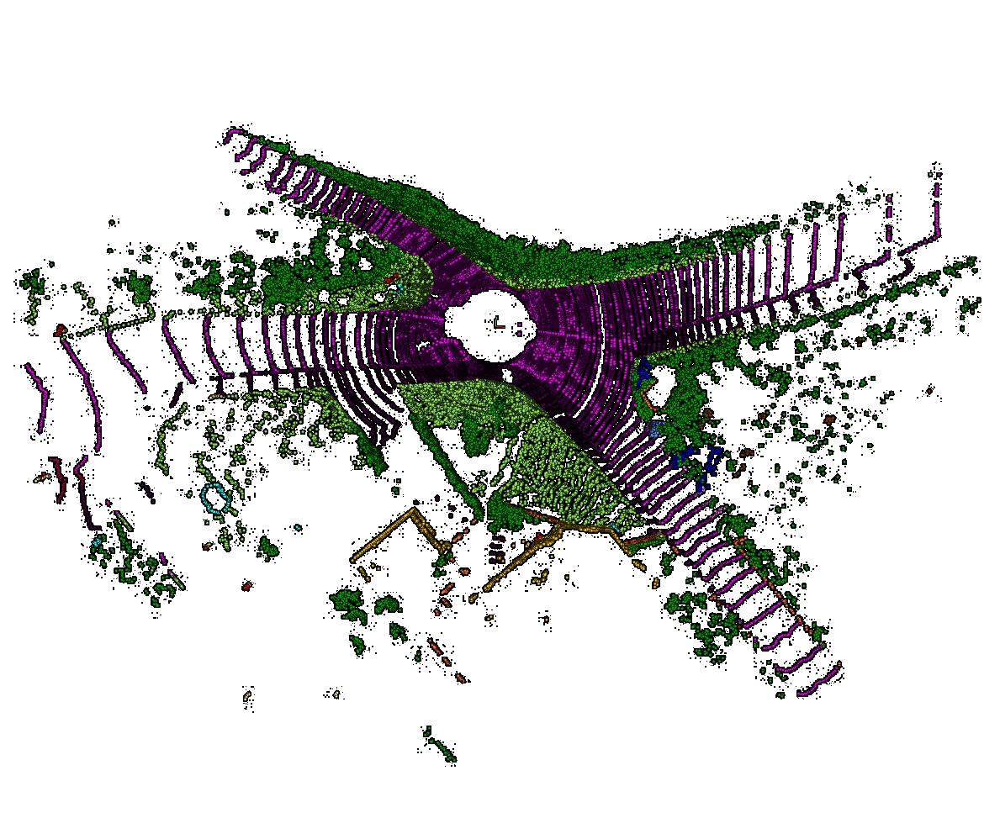

Aero Auto Pilot Segmentation Network(AAPSN): A real-time segmentation technology of point cloud data for UAVs’ autonomous driving
==========

<p align="center">
         <br>
        <em>LiDAR scan visualization of SemanticKITTI dataset(left) and the prediction result of AAPSN(right).</em>
</p>
We have developed the Aero Auto Pilot Segmentation Network (AAPSN) to enhance semantic segmentation of laser point cloud data from unmanned aerial vehicles (UAVs).  This approach addresses challenges such as the loss of spatial features during training and the variability in point cloud densities across different object scales.  By integrating a multi-scale feature extraction module and an attentive pooling mechanism, AAPSN effectively captures features of objects at varying scales and emphasizes spatial structure features during pooling.  This leads to significant improvements in segmentation accuracy and efficiency, with a mean Intersection over Union (mIoU) increase of 3.3% and 19.2% on two real urban LiDAR datasets, respectively.  These results demonstrate the effectiveness of AAPSN in enhancing the autonomy of UAV landing systems.

## Aero Auto Pilot Segmentation Network 

Aero Auto Pilot Segmentation Network is a novel neural network architecture designed to provide robust semantic segmentation for autopilot systems. Unlike traditional methods, which usually involve a lot of computational overhead, our approach simplifies the process by first extracting key features and eliminating redundant point cloud data through a dedicated point sampling module. As shown below, the refined data is then re-projected through BEV-UNet to transform the perspective of the optimal network input. Within the core network, multi-scale feature extraction and attention pool modules work together to capture complex spatial details, and finally reverse projection is performed by BEV-UNet to accurately reconstruct the segmentation map.

<p align="center">
        
</p>
We achieved leading mIoU performance in the LiDAR scan datasets  SemanticKITTI and Paris-Lille-3D.

<center>
	
Model | SemanticKITTI | Paris-Lille-3D
--- | --- | ---
Squeezeseg  | 29.5%  | 36.9%
DarkNet53 | 49.9%  |  40.0%
RangeNet++ | 52.2% |  42.8%
RandLA | 53.9% |  44.3%
TangentConv | 52.2% | 41.6% 
Squeezesegv2  | 39.7% | 30.1% 
**AAPSN**  | **57.6%** | **62.9%**| 

</center>


## Preparations
### Environment

This code is tested on Ubuntu 18.02 with Python 3.9, CUDA 12.2 and Pytorch 1.12.1.


Install the following dependencies by either `pip install -r requirements.txt` or manual installation.
* numpy
* pytorch
* tqdm
* yaml
* Cython
* [numba](https://github.com/numba/numba)
* [torch-scatter](https://github.com/rusty1s/pytorch_scatter)
* [dropblock](https://github.com/miguelvr/dropblock)


### How to get datasets:

Paris-lille-3D datasets：https://npm3d.fr/paris-lille-3d


semanticKITTI datasets: https://semantic-kitti.org/dataset.html#download

When you want to trian with semanticKITTI dataset:
The folder structure for the datasets should be arranged as follows:
```
├── data
│   ├── semantickitti
│   │   ├── sequences
│   │   │   ├── 00
│   │   │   │   ├── labels
│   │   │   │   ├── velodyne
│   │   │   ├── 01
│   │   │   ├── ..
│   │   │   ├── 22
```
And when you want to train with Paris-lille-3D dataset:
The folder structure for the datasets should be arranged as follows:
```
data/
├──NuScenes/
|   ├── trainval/           
|   │   ├── lidarseg/	
|   |   ├── maps/
|   |   ├── ...
|   │   └── v1.0-trainval/ 
|   └── test/
|            └── ...
└──paris_lille/
    ├── coarse_classes.xml
    ├── Lille1.ply
    ├── ...
    └── Paris.ply
```

## Run
```shell
python Kittitrain.py
```
to train a SemanticKITTI segmentation net from scratch after dataset preparation. The code will automatically train, validate and early stop training process.
Similarly , you can use

```shell
python PLtrain.py
```
to train a Paris-Lille segmentation net 


Note that we trained our model on a single Tesla P100 which has 16 GB GPU memory. Training model on GPU with less memory would likely cause GPU out-of-memory. You will see the exception report if there is a OOM. In this case, you might want to train model with smaller quantization grid/ feature map via `python Kitiitrain.py --grid_size 320 240 32`.

## Evaluate our pretrained model

We also provide a pretrained SemanticKITTI PolarNet weight.
```shell
python test_pretrain_SemanticKITTI.py
```

### How to get pretrained weights:

Pretrained weights: https://drive.google.com/drive/folders/1VAkqCPZxOqnCIragI0Xr0nJ0bdhsi0j1?usp=drive_link


